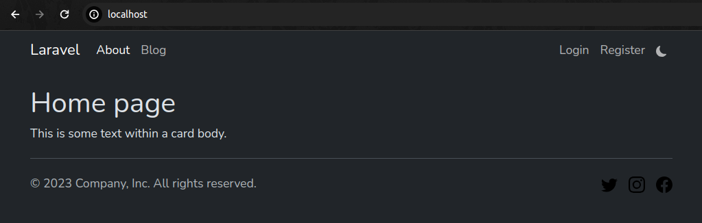
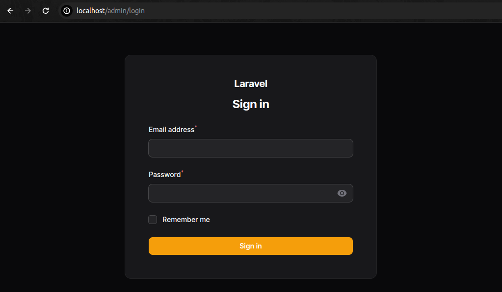
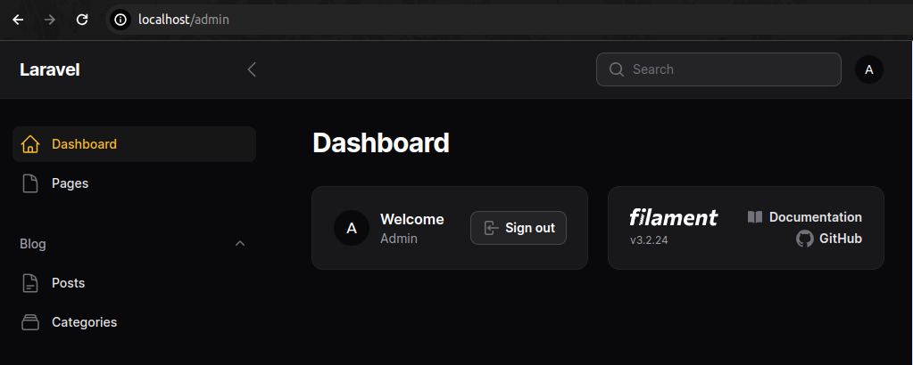
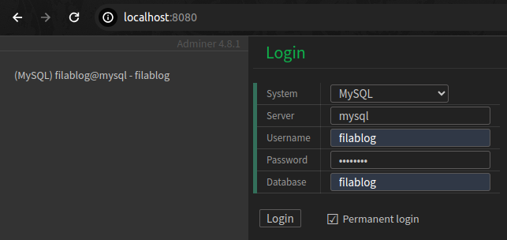
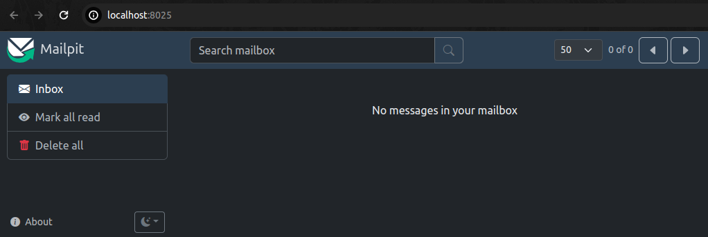

# Blog on Laravel 10 + Filament 3

## Setup

Locally you should have `php` and `composer` installed.

```bash
git clone git@github.com:amberlex78/filablog.git
cd filablog
composer install
cp .env.example .env
php artisan key:generate
php artisan storage:link
npm i
npm run build
sail up -d
sail artisan migrate --seed
```

## Servers

FRONT: Project server running on [http://localhost](http://localhost)



ADMIN: Project server running on  [http://localhost/admin](http://localhost/admin)

```
username: filablog
password: password
```





### Adminer

Adminer server running on [http://localhost:8080](http://localhost:8080)

Used theme: [Adminer eok8177 dark theme](https://github.com/eok8177/adminer.css)




### Mailpit

Mailpit server running on [http://localhost:8025](http://localhost:8025)


